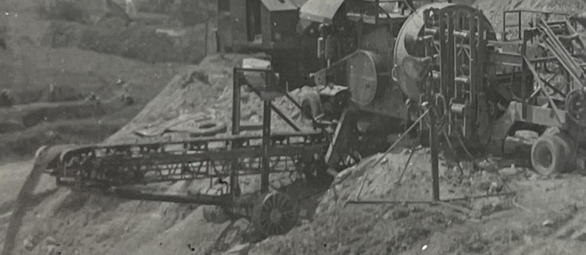

# Portfolio

## Featured Projects

### [Automation](#)
*Automate processes from end to end.*

### [Research Consultation](#)
*Turn your idea into reality.*

## Skills and Techniques
- 3D Modeling: Blender, 3D model repair, 3D modeling consultation
- 3D Printing: 3D model preparation, FDM, Large-format, Print Farm Automation
- Scanning: Photogrammetry, LIDAR, Structured Light Scanning, Project Consulting
- Software: AR/VR applications, 3D model repository, remote viewing
- Systems: Process automation and efficiency revision